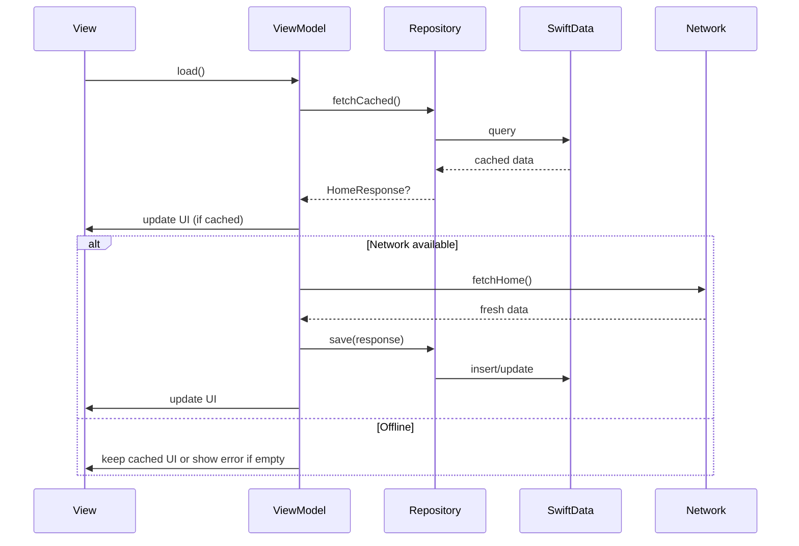

# EBCOM Shop

A SwiftUI iOS e-commerce app for browsing shops, categories, and search with history.

## Overview

ebcomShop is a native iOS app built with SwiftUI: MVVM, a custom async networking layer, and SwiftData for search history.

## Features

- **Home** – Sections for categories, banners, fixed banners, and shop listings
- **Search** – Real-time search with debouncing and persistent history (SwiftData)
- **Shop browsing** – Shops by category and tags; reusable image, tag, and row components
- **Offline Support** – Data cached locally with SwiftData; works without network
- **Storage** – SwiftData for search history and home data caching

## Technical Stack

- **UI**: SwiftUI, reusable components (loading, images, search bar, nav bar, tags, chips)
- **Architecture**: MVVM with `@Observable`, offline-first pattern
- **Networking**: Custom async layer (APIEndpoint, NetworkClient, ResponseHandler, NetworkMonitor)
- **Storage**: SwiftData (search history, home data caching)
- **Testing**: XCTest

## Requirements

- Xcode 15+
- iOS 17+
- Swift 5.9+

## Getting Started

1. Clone the repository.
2. Open `ebcomShop.xcodeproj` in Xcode.
3. Select a simulator or device (iOS 17+).
4. Build and run (`Cmd+R`).

## Project Structure

```
ebcomShop/
├── App/
│   ├── Components/           # AppProgressView, AppImageView, TagView, SearchBarView,
│   │                        # NavBarToolbar, BannerItemView, CategoryItemView,
│   │                        # ShopItemView, SectionHeaderView, ErrorStateView,
│   │                        # NavigationHeaderWithSearch, FAQRowView
│   ├── DI/                  # EnvironmentKeys (homeService, homeRepository, networkMonitor)
│   ├── Home/
│   │   ├── Models/          # BannerModel, CategoryModel, ShopModel, TagModel,
│   │   │                    # FAQPayload, HomeModels, HomeSectionItem
│   │   │   └── Cache/       # CachedHomeResponse (SwiftData)
│   │   ├── Repositories/    # HomeRepositoryProtocol, HomeRepository
│   │   ├── Views/           # HomeView; Sections: Banner, Category, Shop,
│   │   │                    # FixedBanner, FAQ
│   │   ├── ViewModels/      # HomeViewModel
│   │   ├── Services/        # HomeServiceProtocol, HomeServiceImpl
│   │   └── Networking/      # HomeEndpoint
│   └── Search/
│       ├── Models/          # SearchHistoryEntry (SwiftData)
│       ├── Repositories/    # SearchHistoryRepository, SearchHistoryRepositoryProtocol
│       ├── ViewModels/      # SearchViewModel
│       └── Views/           # SearchView, SearchResultRowView, SearchTextResultView,
│                            # SearchHistorySectionView, HistoryChipView
├── Configs/                 # debug.xcconfig, release.xcconfig
├── Constants/               # Constants (NetworkConfigKey), ResponseResult typealias
├── Extensions/               # Dictionary+Extension, Font+Extension (TypographyStyle)
├── Logger/                  # OSLogger
├── Network/                 # NetworkClient, APIEndpoint, APIHandler, ResponseHandler,
│                            # NetworkConfiguration, NetworkError, HTTPMethod, NetworkMonitor
├── Resources/               # Assets.xcassets, Colors.xcassets, Fonts, Info.plist,
│                            # LaunchScreen.storyboard
└── ebcomShopApp.swift       # App entry, ModelContainer (SwiftData)

ebcomShopTests/
├── ViewModels/              # HomeViewModelTests, SearchViewModelTests
├── Repositories/            # HomeRepositoryTests
├── Network/                 # APIEndpointTests, NetworkClientTests, NetworkErrorTests,
│                            # ResponseHandlerTests, NetworkMonitorTests
└── Extensions/              # DictionaryExtensionTests
```

## Testing

- **ViewModels**: HomeViewModel, SearchViewModel (including offline scenarios)
- **Repositories**: HomeRepository
- **Network**: ResponseHandler, NetworkClient, NetworkError, APIEndpoint, NetworkMonitor
- **Extensions**: Dictionary helpers

Run tests in Xcode with `Cmd+U`, or:

```bash
xcodebuild test -scheme ebcomShop -destination 'platform=iOS Simulator,name=iPhone 16'
```

See [ebcomShopTests/README.md](ebcomShopTests/README.md) for details.

## Architecture

The app uses **MVVM** with an **offline-first** data layer: UI always reflects local data first, then syncs with the network when available.

### Layers

| Layer | Responsibility | Examples |
|-------|----------------|----------|
| **View** | SwiftUI UI, layout, user input | HomeView, SearchView, section/row components |
| **ViewModel** | State, business logic, orchestration | HomeViewModel, SearchViewModel (`@Observable`) |
| **Service** | Remote API calls | HomeServiceProtocol, HomeServiceImpl |
| **Repository** | Local persistence (SwiftData) | HomeRepository, SearchHistoryRepository |
| **Network** | HTTP client, connectivity | NetworkClient, NetworkMonitor |

Views depend on ViewModels; ViewModels depend on **protocols** (services, repositories, connectivity) so implementations can be swapped for tests or offline behavior.

### Offline-First Pattern

Data flow is **cache-first, then network**:

1. **Read from DB** – On load, the ViewModel reads from the local repository (SwiftData) and updates UI immediately if cached data exists.
2. **Sync when online** – If the device is connected (`NetworkMonitor`), the ViewModel fetches from the API, writes the response to the repository, then updates UI.
3. **Offline behavior** – If there is no network, the ViewModel does not call the API; UI shows cached data only. Errors are shown only when there is no cache and no connection.
4. **Deletion** – For local-only data (e.g. search history), delete from the repository only; no API call.



### Key Components

- **MVVM** – Models (Decodable/Sendable), SwiftUI views, ViewModels with `@Observable` for reactive updates.
- **Network** – Protocol-based (APIEndpoint, NetworkClientProtocol); async/await. `NetworkMonitor` (via `NetworkConnectivityProviding`) uses `NWPathMonitor` for connectivity.
- **Storage** – SwiftData for search history (SearchHistoryEntry, SearchHistoryRepository) and home cache (CachedHomeResponse, HomeRepository).
- **DI** – Environment keys for `homeService`, `homeRepository`, `networkMonitor`; concrete types created in the app entry and passed into views.

### Reusable UI

Shared components: AppProgressView, AppImageView, TagView, SearchBarView, NavBarToolbar, section/row/chip views (BannerItemView, CategoryItemView, ShopItemView, etc.).

## Dependencies

- **Kingfisher** – image loading and caching
- **SwiftUI**, **SwiftData**, **Foundation** – built-in

## Configuration

- `Network/NetworkConfiguration.swift` – base URL from Info.plist / .xcconfig
- `Constants/Constants.swift` – NetworkConfigKey (e.g. API_BASE_URL)
